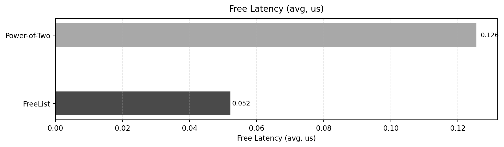
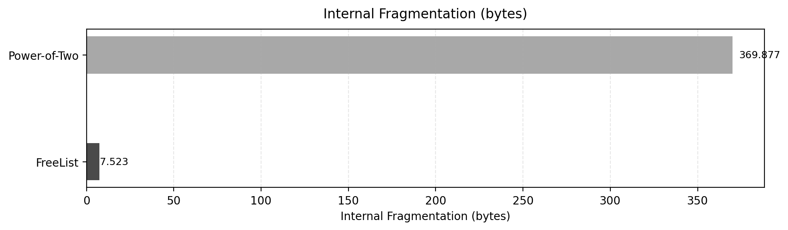

📦 Курсовой проект: Исследование аллокаторов памяти  
FreeList Allocator и Power-of-Two Allocator


## 👤 Автор проекта


**Данил Дружинин**  
Основатель «Аллокаторы» (2025)  
C++ Developer


🧠 Описание проекта
Этот проект посвящён исследованию двух аллокаторов памяти:

1) 🟦 FreeList Allocator — классический аллокатор со свободным списком  
2) 🟩 Power-of-Two Allocator — выделяет блоки только степеней двойки  

Работа включает:
• 🔧 разработку двух аллокаторов  
• 🧪 корректные тесты (GoogleTest)  
• ▶️ демо-программу  
• 🚀 бенчмарк с 13 метриками  
• 📊 визуализацию результатов (PNG-графики)  
• 📈 сравнительный анализ  


## 📁 Структура проекта

```
cp_var19/
├── graphs/
│   ├── malloc_latency.png
│   ├── free_latency.png
│   ├── internal_frag.png
│   ├── external_frag.png
│   └── allocator_metrics_table.png
├── include/
│   ├── allocator_common.h
│   ├── freelist_allocator.h
│   └── pow2_allocator.h
├── src/
│   ├── allocator_common.cpp
│   ├── freelist_allocator.cpp
│   ├── pow2_allocator.cpp
│   ├── demo_main.cpp
│   └── benchmark.cpp
├── tests/
│   └── gtest_allocators.cpp
├── CMakeLists.txt
└── README.md
```

🧪 Тестирование
Проект использует GoogleTest.

## ▶️ Запуск тестов

```bash
mkdir build
cd build
cmake ..
make -j4
./allocator_tests
```


🚀 Бенчмарк
Бенчмарк измеряет 13 ключевых метрик:

• ⚡ avg malloc/free latency — средняя задержка  
• 🎯 p50 — медианная задержка  
• 📈 p95 — задержка 95-го перцентиля  
• 🚨 p99 — задержка 99-го перцентиля  
• 🔁 jitter (p99 − p50)  
• ✂️ split count — количество разделений  
• 🩹 merge count — количество слияний  
• 🧱 internal fragmentation  
• 🧩 external fragmentation  
• 🏗 max free block  
• 📊 peak allocated  
• ❌ allocation failures  
• ⚠️ free failures  

## ▶️ Запуск бенчмарка

```bash
cd build
./benchmark
```


📊 Графики анализа

• malloc_latency.png

• free_latency.png

• internal_frag.png  

• external_frag.png  

• allocator_metrics_table.png  


## 🛠 Сборка проекта

```bash
mkdir build
cd build
cmake ..
make -j4
```


🎯 Дополнительно
• написано на C++17  
• совместимо с Linux/macOS  
• минимальная CMake-конфигурация  
• результаты бенчмарков воспроизводимы  